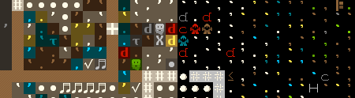

DFTileConverter is a python program that given a DF screenshot, will convert it to another tileset.

## Setup

1. Install requirements:

`pip install -r requirements.txt`

2. Due to Github file size restrictions, run the precomputation script from `TilesetScrapper.py`:

`precompute_tilesets(precompute_tileset_info_files, postcompute_tileset_info_file)`

## Usage

1. Pass in a unique tileset name to `get_tileset` from `LoadTilesets.py`. Here, a unique name refers to a unique string found in the tileset filename.
2. Using the result from step 1, call `convert_screenshot` from `Convert.py`.
3. Celebrate!

## Project Layout

* Convert
** This file is aimed at the actual act of converting screenshots between different tilesets.
* LoadTilesets
** This file is aimed at loading tilesets and interacting with them. Some precomputations take place here. (Aka numpy related precomputations.)
* Testing
** This file is aimed at testing parts of the project to ensure stability.
* TilesetScrapper
** This file is aimed at scrapping tilesets from the DF wiki, and precomputing some tileset data. (

## Contributing

Want to contribute? That's very kind of you!

For documentation purposes, please start by making an issue describing the issue/change, with an example if possible.

Next, make a branch with code changes and submit it via a pull request. The pull request will be run under a few tests, a few of which can sometimes fail.

If everything's looking good, the pull request will be merged in.